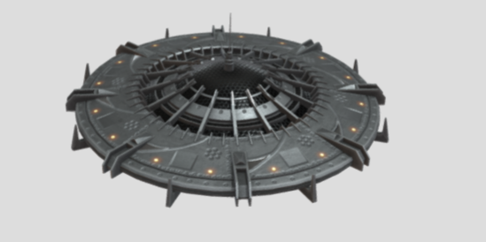

# AR_Thing_on_chessboard

This project implements **camera pose estimation** and **augmented reality (AR)** visualization using OpenCV and Open3D. A chessboard is used to estimate the camera’s extrinsic parameters, and a custom 3D model (e.g., UFO, Saturn, or cube) is overlaid in real-time.

## 🎯 Features

### 📌 Camera Pose Estimation
- Uses a previously calibrated camera (from Homework #3)
- Estimates camera pose using OpenCV's `solvePnP` with a 10x7 chessboard pattern
- Computes and displays camera XYZ position relative to the board
 ## 🔹 Calibration Results
| fx        | fy        | cx        | cy        | RMSE  |
|-----------|-----------|-----------|-----------|--------|
| 313.0     | 273.5     | 1041.9    | 567.0     | 2.564  |
| 760.6     | 708.7     | 966.4     | 539.2     | 4.330  |
| 792.9     | 734.4     | 952.5     | 534.8     | 4.974  |

### 📌 Augmented Reality Rendering
- Draws various virtual AR objects on the chessboard based on pose
  - ✅ Custom 3D model (GLB) rendered with Open3D(/data/classic_ufo.glb)
  - ✅ Real-time animation (rotation or floating)
  - ✅ Alternative objects: rotating cube, Saturn ring, emoji face
- Can be easily extended to other formats or engines (VTK, Three.js, etc.)

---

## 🧪 Demo Results

### ✅ Screenshot of AR UFO Model Overlay
| Real Chessboard | UFO | AR UFO Rendered |
|-----------------|------------------|------------------|
|  ||  |

> *Top: Real chessboard image*  
> *Middle: UFO image*
> *Bottom: Overlayed 3D UFO model in AR (rotating animation)*
